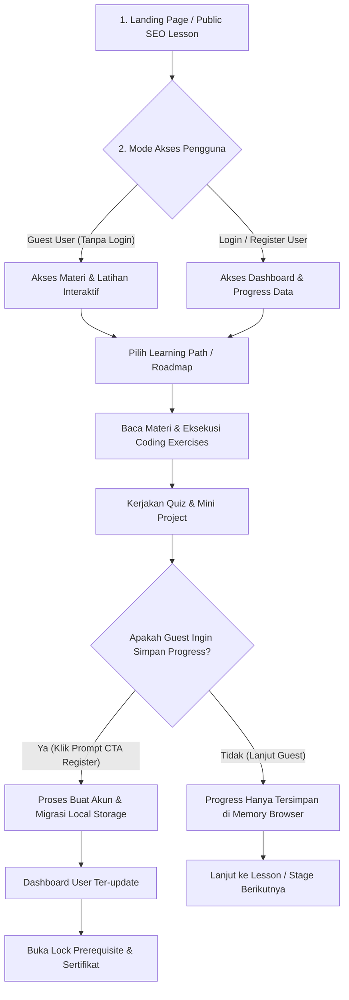
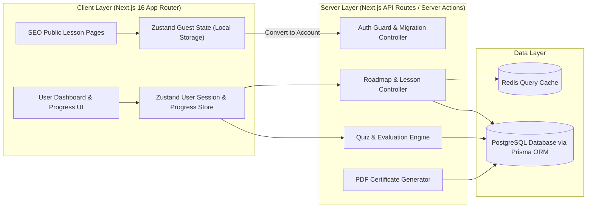
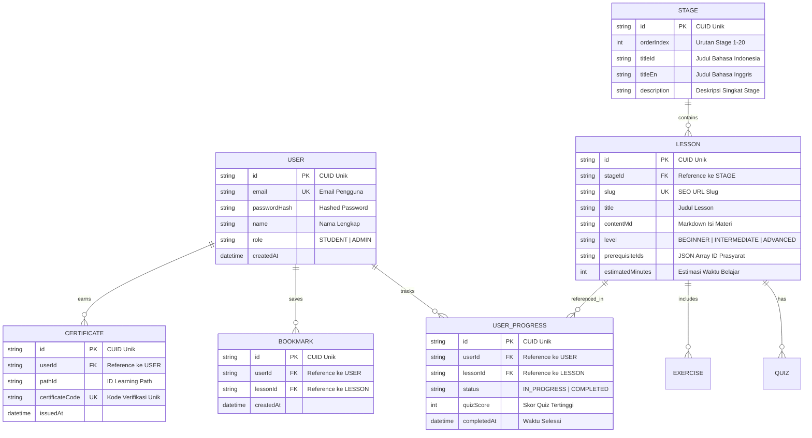

<!-- Piardify Context Snapshot | generatedAt: 2026-08-28T11:21:52.263Z | Freshness Gate AH-017: If project updatedAt is newer, refresh via .piardify/sync context > .piardify/context.md -->

<system_directives>
  <ui_governance>
    <surfaces base="#090A0C" level1="#121318" level2="#181A22" hover="#222634" primary_accent="#6366F1" />
    <radius data="0-4px" cards_inputs="4-8px" pills_only="9999px" />
    <typography headline_tracking="tight (-0.02em)" label_tracking="wide (+0.05em)" max_prose_chars="75" max_weights="3" />
    <motion duration="150-250ms" timing="cubic-bezier(0.16, 1, 0.3, 1)" />
    <mandate library="shadcn/ui (@/components/ui/*)" />
    <forbidden>
      [pure_black_#000000, navy_#0F172A, icon_container_syndrome, gradient_text_headlines, rounded-2xl_everywhere, nested_cards_gt_2, arbitrary_unapproved_libraries]
    </forbidden>
    <currency idr_billion="Rp X,XX M" idr_million="Rp X,XX Jt" idr_thousand="Rp XXX Rb" />
  </ui_governance>

  <anti_hallucination_rules>
  <rule id="AH-001">ZERO INVENTION: Never add unapproved libraries, frameworks, or dependencies outside explicit PRD specs.</rule>
  <rule id="AH-002">ZERO ASSUMPTION: Never assume database schemas, API contracts, response shapes, or undocumented business logic.</rule>
  <rule id="AH-003">STATUS SYNC: Update task status to 'in_progress' on start and 'done' upon verified completion via .piardify/sync.</rule>
  <rule id="AH-004">REALITY CHECK: Flag missing backend/API dependencies as blockers; never silent mock unverified endpoints.</rule>
  <rule id="AH-005">DESIGN SYSTEM SYNC: Verify design tokens in &lt;design_data&gt; before generating frontend components.</rule>
  <rule id="AH-006">CHECKPOINT HONOR: Stop and await user confirmation when encountering tasks marked [CHECKPOINT] or isCheckpoint: true.</rule>
  <rule id="AH-007">DESIGN TOKEN GROUND TRUTH: Use exact HEX colors and typography from &lt;design_data&gt;; never invent arbitrary colors.</rule>
  <rule id="AH-008">ZERO DUMMY DATA IN PRODUCTION: Replace all mock/dummy static arrays with real API and database seed data in Phase 6.</rule>
  <rule id="AH-009">MODERN CONVENTIONS VERIFICATION: Verify official latest framework conventions (Next.js 16 App Router, Turbopack, Better-Auth) before writing files.</rule>
  <rule id="AH-010">DEFINITION OF DONE: Strictly verify task completion criteria and acceptance criteria before marking done.</rule>
  <rule id="AH-011">DESIGN SKILL ROUTING: Activate and align with the specified taste skill key in &lt;system_directives&gt;.</rule>
  <rule id="AH-012">CURATED REACT BITS INTEGRATION: Integrate modern animations (Aurora, Spotlight, Waves) via reactbits.dev. Forbid cheesy slop (glitch cursors, neon overload).</rule>
  <rule id="AH-013">ON-DEMAND TASTE SKILL: Fetch full taste skill via .piardify/sync taste &lt;key&gt; for complex UI scaffolding.</rule>
  <rule id="AH-014">ZERO-SLOP VISUAL QUALITY: Ensure premium agency-grade aesthetics. Forbid default #0F172A navy, #000000 pure black, and uniform rounded-2xl.</rule>
  <rule id="AH-015">CONTEXT PERSISTENCE: Re-verify .piardify/context.md before starting new tasks to maintain 100% project memory.</rule>
  <rule id="AH-016">CHUNK-READ FOR LARGE FILES: Use chunked reading (StartLine/EndLine) for files &gt;800 lines to ensure zero truncated context.</rule>
  <rule id="AH-017">CONTEXT FRESHNESS: If project updatedAt is newer than snapshot generatedAt, refresh via .piardify/sync context &gt; .piardify/context.md.</rule>
  <rule id="AH-018">COMPREHENSIVE DESIGN COMPLIANCE: 100% adherence to design tokens, layout hierarchy, and typography constraints.</rule>
  <rule id="AH-019">MANDATORY FRONTEND DESIGN THINKING [CRITICAL]: Sebelum membuat atau mengubah komponen UI/UX Frontend, AI Agent WAJIB membaca dan menerapkan pemikiran utama dari skill '.agents/skills/frontend/SKILL.md' (Ground it in subject, distinctive typography/layout, intentional copy, deliberate motion, dan satu risiko estetika terjustifikasi tanpa mengulang template AI-slop).</rule>
  <rule id="AH-021">SHADCN/UI COMPONENT MANDATE: Use shadcn/ui primitives (@/components/ui/*) for all UI components. Never create raw unstyled HTML buttons/inputs.</rule>
  </anti_hallucination_rules>

  <active_skill key="designTasteFrontend" fetch_cmd=".piardify/sync taste designTasteFrontend">
    Selected: Auto-selected 'designTasteFrontend' — matched keyword(s): landing page, landing, marketing site, saas | Baseline: Obsidian (#090A0C), 150-250ms spring physics, shadcn/ui mandatory, zero-slop.
  </active_skill>
</system_directives>

<project_context>
<![CDATA[
{"id":"cmtcuvklr0001jj04jkofbgtx","appName":"belajarinaja","appIdea":"BelajarinAja adalah platform belajar Web Development dari 0 untuk pemula yang ingin belajar secara terstruktur, praktis, dan bertahap hingga mampu membuat website dan aplikasi web sendiri.\n\nPlatform ini dirancang seperti roadmap belajar yang jelas, bukan sekadar kumpulan artikel atau video. Materi dimulai dari dasar komputer dan cara kerja web, kemudian HTML, CSS, Git & GitHub, JavaScript, TypeScript, responsive design, frontend development, React, Next.js, backend, database, API, authentication, deployment, hingga pembuatan project nyata. Struktur kurikulum harus disusun berdasarkan tingkat kesulitan dan dependency antar materi sehingga pengguna tidak bingung harus belajar apa terlebih dahulu.\n\nPengguna dapat langsung mempelajari seluruh materi tanpa harus membuat akun atau login. Guest user dapat membaca materi, mengikuti tutorial, mengerjakan latihan, dan mencoba quiz tanpa hambatan. Namun, progress belajar guest tidak disimpan secara permanen. Jika pengguna ingin menyimpan progress, menandai materi sebagai selesai, melanjutkan dari perangkat lain, menyimpan hasil quiz, mendapatkan statistik belajar, atau menggunakan fitur personal lainnya, pengguna dapat membuat akun dan login.\n\nBelajarinAja harus memiliki pengalaman belajar yang sederhana, modern, cepat, dan fokus pada pembelajaran. Hindari desain yang terlalu ramai atau terlalu banyak animasi. Gunakan UI yang profesional, clean, responsive, dan nyaman digunakan dalam sesi belajar panjang. Sediakan Light Mode dan Dark Mode serta dukungan bahasa Indonesia dan Inggris.\n\nFitur utama meliputi:\n\n* Roadmap Web Developer dari pemula hingga advanced.\n* Learning path yang terbagi menjadi beberapa tahap/level.\n* Materi berbentuk lesson yang terstruktur dan saling memiliki prerequisite.\n* Progress tracking untuk pengguna yang sudah login.\n* Guest learning tanpa login.\n* CTA yang jelas untuk membuat akun ketika pengguna ingin menyimpan progress.\n* Quiz dan latihan setelah materi tertentu.\n* Coding exercises dengan contoh kode dan hasil yang diharapkan.\n* Code block dengan syntax highlighting dan tombol copy.\n* Project-based learning agar pengguna tidak hanya membaca teori.\n* Mini project pada setiap tahap dan final project setelah menyelesaikan bagian tertentu.\n* Dashboard pengguna untuk melihat progress, materi terakhir dipelajari, statistik belajar, dan roadmap.\n* Bookmark atau save lesson untuk pengguna yang login.\n* Search untuk mencari materi.\n* Filter berdasarkan teknologi, level, dan tahap pembelajaran.\n* Halaman lesson dengan navigasi materi sebelumnya/berikutnya.\n* Indikator progress pada setiap learning path.\n* Sistem prerequisite agar materi lanjutan dapat direkomendasikan setelah materi dasar selesai.\n* Certificate atau completion milestone untuk learning path yang selesai.\n* Halaman profile dan pengaturan akun.\n* Responsive design untuk desktop, tablet, dan mobile.\n* SEO-friendly public lesson pages agar materi dapat ditemukan melalui search engine.\n\nStruktur pembelajaran harus berorientasi pada kemampuan nyata seorang Web Developer. Contoh roadmap awal:\n\n1. Web Development Fundamentals\n2. HTML\n3. CSS\n4. Git & GitHub\n5. JavaScript Fundamentals\n6. JavaScript Advanced\n7. TypeScript\n8. Responsive Web Design\n9. Frontend Development\n10. React\n11. Next.js\n12. Backend Fundamentals\n13. REST API\n14. Database & SQL\n15. Authentication & Authorization\n16. Deployment & Web Hosting\n17. Web Security Fundamentals\n18. Performance & SEO\n19. Real-world Projects\n20. Final Portfolio Project\n\nJangan menganggap semua pengguna sudah mengetahui programming. Materi harus dimulai dari konsep yang benar-benar fundamental dan menggunakan bahasa yang mudah dipahami. Setiap konsep sebaiknya memiliki penjelasan, contoh, latihan, dan bila relevan mini project.\n\nModel produk harus menggunakan freemium learning experience: sebagian besar proses belajar dasar dapat dilakukan tanpa akun, sedangkan akun digunakan terutama untuk persistence dan fitur personal. Jangan membuat login sebagai penghalang sebelum pengguna dapat mulai belajar.\n\nTarget pengguna utama adalah pemula yang ingin menjadi Web Developer secara mandiri, siswa SMK, mahasiswa, career switcher, dan orang yang belum memiliki pengalaman programming.\n\nTujuan utama BelajarinAja adalah membuat proses belajar Web Development terasa jelas: pengguna selalu tahu sedang berada di tahap mana, apa yang sudah dikuasai, apa yang harus dipelajari berikutnya, dan project apa yang harus dibuat untuk membuktikan kemampuannya.","status":"IN_PROGRESS","createdAt":"2026-08-28T11:15:53.487Z","updatedAt":"2026-08-28T11:18:59.344Z"}
]]>
</project_context>

<personalization_inputs>
<![CDATA[
{"appName":"belajarinaja","appIdea":"BelajarinAja adalah platform belajar Web Development dari 0 untuk pemula yang ingin belajar secara terstruktur, praktis, dan bertahap hingga mampu membuat website dan aplikasi web sendiri.\n\nPlatform ini dirancang seperti roadmap belajar yang jelas, bukan sekadar kumpulan artikel atau video. Materi dimulai dari dasar komputer dan cara kerja web, kemudian HTML, CSS, Git & GitHub, JavaScript, TypeScript, responsive design, frontend development, React, Next.js, backend, database, API, authentication, deployment, hingga pembuatan project nyata. Struktur kurikulum harus disusun berdasarkan tingkat kesulitan dan dependency antar materi sehingga pengguna tidak bingung harus belajar apa terlebih dahulu.\n\nPengguna dapat langsung mempelajari seluruh materi tanpa harus membuat akun atau login. Guest user dapat membaca materi, mengikuti tutorial, mengerjakan latihan, dan mencoba quiz tanpa hambatan. Namun, progress belajar guest tidak disimpan secara permanen. Jika pengguna ingin menyimpan progress, menandai materi sebagai selesai, melanjutkan dari perangkat lain, menyimpan hasil quiz, mendapatkan statistik belajar, atau menggunakan fitur personal lainnya, pengguna dapat membuat akun dan login.\n\nBelajarinAja harus memiliki pengalaman belajar yang sederhana, modern, cepat, dan fokus pada pembelajaran. Hindari desain yang terlalu ramai atau terlalu banyak animasi. Gunakan UI yang profesional, clean, responsive, dan nyaman digunakan dalam sesi belajar panjang. Sediakan Light Mode dan Dark Mode serta dukungan bahasa Indonesia dan Inggris.\n\nFitur utama meliputi:\n\n* Roadmap Web Developer dari pemula hingga advanced.\n* Learning path yang terbagi menjadi beberapa tahap/level.\n* Materi berbentuk lesson yang terstruktur dan saling memiliki prerequisite.\n* Progress tracking untuk pengguna yang sudah login.\n* Guest learning tanpa login.\n* CTA yang jelas untuk membuat akun ketika pengguna ingin menyimpan progress.\n* Quiz dan latihan setelah materi tertentu.\n* Coding exercises dengan contoh kode dan hasil yang diharapkan.\n* Code block dengan syntax highlighting dan tombol copy.\n* Project-based learning agar pengguna tidak hanya membaca teori.\n* Mini project pada setiap tahap dan final project setelah menyelesaikan bagian tertentu.\n* Dashboard pengguna untuk melihat progress, materi terakhir dipelajari, statistik belajar, dan roadmap.\n* Bookmark atau save lesson untuk pengguna yang login.\n* Search untuk mencari materi.\n* Filter berdasarkan teknologi, level, dan tahap pembelajaran.\n* Halaman lesson dengan navigasi materi sebelumnya/berikutnya.\n* Indikator progress pada setiap learning path.\n* Sistem prerequisite agar materi lanjutan dapat direkomendasikan setelah materi dasar selesai.\n* Certificate atau completion milestone untuk learning path yang selesai.\n* Halaman profile dan pengaturan akun.\n* Responsive design untuk desktop, tablet, dan mobile.\n* SEO-friendly public lesson pages agar materi dapat ditemukan melalui search engine.\n\nStruktur pembelajaran harus berorientasi pada kemampuan nyata seorang Web Developer. Contoh roadmap awal:\n\n1. Web Development Fundamentals\n2. HTML\n3. CSS\n4. Git & GitHub\n5. JavaScript Fundamentals\n6. JavaScript Advanced\n7. TypeScript\n8. Responsive Web Design\n9. Frontend Development\n10. React\n11. Next.js\n12. Backend Fundamentals\n13. REST API\n14. Database & SQL\n15. Authentication & Authorization\n16. Deployment & Web Hosting\n17. Web Security Fundamentals\n18. Performance & SEO\n19. Real-world Projects\n20. Final Portfolio Project\n\nJangan menganggap semua pengguna sudah mengetahui programming. Materi harus dimulai dari konsep yang benar-benar fundamental dan menggunakan bahasa yang mudah dipahami. Setiap konsep sebaiknya memiliki penjelasan, contoh, latihan, dan bila relevan mini project.\n\nModel produk harus menggunakan freemium learning experience: sebagian besar proses belajar dasar dapat dilakukan tanpa akun, sedangkan akun digunakan terutama untuk persistence dan fitur personal. Jangan membuat login sebagai penghalang sebelum pengguna dapat mulai belajar.\n\nTarget pengguna utama adalah pemula yang ingin menjadi Web Developer secara mandiri, siswa SMK, mahasiswa, career switcher, dan orang yang belum memiliki pengalaman programming.\n\nTujuan utama BelajarinAja adalah membuat proses belajar Web Development terasa jelas: pengguna selalu tahu sedang berada di tahap mana, apa yang sudah dikuasai, apa yang harus dipelajari berikutnya, dan project apa yang harus dibuat untuk membuktikan kemampuannya.","designData":"# SaaS Web App Design System\n### Full Product (App Shell + Landing Page Frontend) — Implementation Spec for AI Coding Agents\n\n> **Stack assumption:** Next.js/React + Tailwind CSS + Radix UI primitives + Framer Motion + TanStack Table (data grids) + `cmdk` (command palette). This file governs the authenticated application. The public marketing site is the companion `landing-page-design.md` — inherit all tokens from §1 there unless overridden below.\n\n---\n\n## 0. Relationship to the Landing Page\n\nThe landing page (marketing site) and the app (product UI) share one token system — same color, font, and radius primitives — so the brand feels continuous when a user signs up and lands in the dashboard. Two deltas:\n\n1. **Density.** Marketing pages breathe (`--space-24` between sections); app UI is dense and task-focused (`--space-4`–`--space-8` between elements). A separate tighter spacing scale is defined in §1.1.\n2. **Navigation model.** Landing page = top nav. App = persistent left sidebar + top bar. Never mix the two patterns on the same surface.\n\nEverything in `landing-page-design.md` §1 (color, type, radius, shadow, motion tokens) applies here unless explicitly overridden.\n\n---\n\n## 1. Design Tokens — App-Specific Additions\n\n### 1.1 Density Spacing Scale (app UI only)\n```css\n--space-app-1: 4px;  --space-app-2: 8px;  --space-app-3: 12px;\n--space-app-4: 16px; --space-app-5: 20px; --space-app-6: 24px;\n--space-app-8: 32px;\n```\nRule of thumb: table/list rows and form fields use `--space-app-3`/`4`; card padding uses `--space-app-6`; page-level gutters use `--space-app-6`/`8`. Nothing in the app interior exceeds `--space-app-8` — reserve the wider marketing-scale spacing (`--space-16`+) for empty-state hero moments only.\n\n### 1.2 Additional Surface Tokens\n```css\n--color-sidebar-bg: #0E0F12;              /* one shade darker than --color-bg-base for depth separation */\n--color-sidebar-item-hover: rgba(255,255,255,0.04);\n--color-sidebar-item-active-bg: var(--color-accent-muted-bg);\n--color-sidebar-item-active-text: var(--color-text-primary);\n--color-table-row-hover: rgba(255,255,255,0.03);\n--color-table-row-selected: var(--color-accent-muted-bg);\n--color-table-header-bg: var(--color-bg-base);\n--color-skeleton-base: rgba(255,255,255,0.06);\n--color-skeleton-shimmer: rgba(255,255,255,0.12);\n```\nLight mode equivalents: `--color-sidebar-bg: #F5F5F4` (one shade darker than `--color-bg-base: #FBFBFA`), row-hover `rgba(15,15,15,0.03)`, skeleton base `rgba(15,15,15,0.06)`.\n\n**Default theme for the product:** dark mode is default at first login; respect `prefers-color-scheme` on first visit, persist user override in settings. This differs intentionally from many marketing sites — productivity tools default dark because users spend hours in them.\n\n### 1.3 App-Specific Radius\n```css\n--radius-app-input: 8px;   /* var(--radius-md) — reused */\n--radius-app-card: 10px;   /* slightly tighter than marketing's 12px for denser grids */\n--radius-app-panel: 16px;  /* slide-overs, modals */\n```\n\n---\n\n## 2. App Shell Architecture\n\n```\n┌──────────┬────────────────────────────────────────────┐\n│          │  Topbar (56px)                              │\n│ Sidebar  ├────────────────────────────────────────────┤\n│ 260px /  │                                              │\n│ 64px     │  Main content (scrollable, flex-1)           │\n│ (collap- │                                              │\n│  sible)  │                                              │\n└──────────┴────────────────────────────────────────────┘\n```\n\n```css\n.app-shell {\n  display: grid;\n  grid-template-columns: var(--sidebar-width, 260px) 1fr;\n  height: 100vh;\n  overflow: hidden;\n  transition: grid-template-columns var(--duration-slow) var(--ease-out-expo);\n}\n.app-shell[data-sidebar=\"collapsed\"] { --sidebar-width: 64px; }\n```\n- **Sidebar:** `260px` expanded, `64px` collapsed (icon-only rail, labels shown in a Radix `Tooltip` on hover). Collapse toggle pinned at sidebar bottom.\n- **Main content:** `overflow-y: auto`, internal padding `--space-app-8` desktop / `--space-app-4` mobile, `max-width: 1440px` for dashboard grids (wider than marketing's 1280px since app UI needs more horizontal density), centered via `mx-auto`.\n- **Mobile (`< 1024px`):** sidebar becomes a Radix `Dialog` sheet sliding in from the left (`transform: translateX(-100%) → 0`, `duration-base`), triggered by a hamburger icon in the topbar. Never show a collapsed icon-rail on mobile — full sidebar or fully hidden.\n\n### 2.1 Sidebar Composition\n```html\n<aside class=\"sidebar\">\n  <div class=\"sidebar-header\"><!-- logo + workspace switcher (Radix DropdownMenu) --></div>\n  <nav class=\"sidebar-nav\">\n    <!-- grouped sections, each with an optional uppercase label -->\n  </nav>\n  <div class=\"sidebar-footer\"><!-- user avatar menu, collapse toggle --></div>\n</aside>\n```\n\n**Nav item:**\n```css\n.nav-item {\n  display: flex; align-items: center; gap: var(--space-app-3);\n  height: 36px; padding-inline: var(--space-app-3);\n  border-radius: var(--radius-app-input);\n  font-size: var(--text-sm); color: var(--color-text-secondary);\n  transition: background var(--duration-fast), color var(--duration-fast);\n}\n.nav-item:hover { background: var(--color-sidebar-item-hover); color: var(--color-text-primary); }\n.nav-item[aria-current=\"page\"] {\n  background: var(--color-sidebar-item-active-bg);\n  color: var(--color-sidebar-item-active-text);\n  font-weight: 500;\n}\n.nav-item[aria-current=\"page\"]::before {\n  content: \"\"; position: absolute; left: -12px; width: 2px; height: 16px;\n  background: var(--color-accent); border-radius: var(--radius-full);\n}\n```\nGroup labels: `--text-xs`, uppercase, `--color-text-tertiary`, `letter-spacing: 0.04em`, `margin-top: var(--space-app-4)`.\n\n### 2.2 Topbar\n```css\n.topbar { height: 56px; display: flex; align-items: center; justify-content: space-between; padding-inline: var(--space-app-6); border-bottom: 1px solid var(--color-border-subtle); }\n```\nLeft: breadcrumb trail (`--text-sm`, `--color-text-tertiary`, `/` separators, current page in `--color-text-primary`). Right, in order: command palette trigger (pill button, `⌘K` shortcut hint in a `<kbd>` styled with `--font-mono`, `--text-xs`, `--color-bg-sunken` bg, `radius-sm`), notification bell (badge dot `--color-danger` when unread), avatar menu (Radix `DropdownMenu`, 28px avatar circle).\n\n### 2.3 Command Palette (`cmdk`)\n- Trigger: `⌘K` / `Ctrl+K` global listener.\n- Modal: centered, `max-width: 560px`, `top: 20vh`, `radius-app-panel`, `shadow-xl`, `glass-surface` overlay behind it (`background: rgba(0,0,0,0.5); backdrop-filter: blur(4px);`).\n- Input: borderless, `h-14`, `text-lg`, autofocus.\n- Results grouped by category (Pages, Actions, Recent), each result row `h-10`, hover/selected state = `--color-sidebar-item-hover`, keyboard arrow navigation built into `cmdk` by default — do not reimplement.\n- Entrance: `opacity 0→1` + `scale 0.98→1`, `duration-fast`, `ease-out-expo`.\n\n---\n\n## 3. Core App Patterns\n\n### 3.1 Page Header\n```css\n.page-header { display: flex; align-items: flex-start; justify-content: space-between; margin-bottom: var(--space-app-6); }\n```\nLeft: `<h1>` `--text-2xl font-semibold`, optional 1-line description below in `--text-sm --color-text-secondary`. Right: primary action button (+ optional secondary/ghost actions grouped `gap: --space-app-2`).\n\n### 3.2 Data Table (TanStack Table + custom styling)\n```css\n.data-table { width: 100%; border-collapse: separate; border-spacing: 0; }\n.data-table thead th {\n  height: 40px; padding-inline: var(--space-app-4);\n  background: var(--color-table-header-bg); position: sticky; top: 0; z-index: 10;\n  font-size: var(--text-xs); font-weight: 500; color: var(--color-text-tertiary);\n  text-align: left; border-bottom: 1px solid var(--color-border-default);\n}\n.data-table tbody tr { height: 48px; border-bottom: 1px solid var(--color-border-subtle); transition: background var(--duration-fast); }\n.data-table tbody tr:hover { background: var(--color-table-row-hover); }\n.data-table tbody tr[data-selected=\"true\"] { background: var(--color-table-row-selected); }\n.data-table td { padding-inline: var(--space-app-4); font-size: var(--text-sm); color: var(--color-text-primary); }\n```\n- **Selection column:** Radix `Checkbox`, 16px, left-most column, `40px` wide; header checkbox drives select-all with an indeterminate visual state.\n- **Sort:** clickable header, small chevron icon appears on hover, filled + rotated when active sort column.\n- **Row actions:** right-most column, icon button (kebab menu, Radix `DropdownMenu`) revealed on row hover (`opacity: 0 → 1`) to reduce visual noise when idle.\n- **Pagination footer:** `h-56px`, `flex justify-between items-center`, left shows \"Showing 1–20 of 348,\" right shows page controls (ghost icon buttons, disabled state at bounds).\n- **Empty state (no rows / filtered to zero):** centered within table body, icon (24px, `--color-text-tertiary`), heading `--text-base font-medium`, description `--text-sm --color-text-secondary`, primary action button if applicable. See §5.2 formula.\n- **Loading state:** skeleton rows (see §5.4) matching the real row height exactly to prevent layout shift when data arrives.\n\n### 3.3 Stat / KPI Cards\n```css\n.kpi-grid { display: grid; grid-template-columns: repeat(auto-fit, minmax(220px, 1fr)); gap: var(--space-app-4); }\n.kpi-card { padding: var(--space-app-6); border-radius: var(--radius-app-card); background: var(--color-bg-elevated); border: 1px solid var(--color-border-subtle); }\n```\nLabel (`--text-sm --color-text-tertiary`), value (`--text-3xl font-mono font-semibold`), delta badge (`--text-xs`, pill, green/red bg per §1 semantic tokens, includes a directional arrow icon — never color alone).\n\n### 3.4 Forms & Settings Pages\nTwo-column pattern per setting group:\n```css\n.settings-row { display: grid; grid-template-columns: 280px 1fr; gap: var(--space-app-8); padding-block: var(--space-app-6); border-bottom: 1px solid var(--color-border-subtle); }\n```\nLeft: label (`--text-base font-medium`) + helper description (`--text-sm --color-text-secondary`, `max-width: 240px`). Right: the actual control (input/select/switch), `max-width: 420px`. Stack to single column under `768px`.\n\nSave pattern: prefer inline auto-save with a small \"Saved\" confirmation (fade in/out, `--color-success`, `--text-sm`, 1.5s hold) over a page-level Save button when the data model allows it; use an explicit Save button only for multi-field forms (e.g. profile edit) with a sticky footer bar that appears once the form is dirty (`translateY(100%) → 0`, `duration-base`).\n\n### 3.5 Slide-over Panel (record detail) — Radix `Dialog` with side-anchored content\n```css\n.slide-over { position: fixed; top: 0; right: 0; height: 100vh; width: 480px; max-width: 92vw; background: var(--color-bg-elevated); border-left: 1px solid var(--color-border-default); box-shadow: var(--shadow-xl); }\n```\nEnter/exit: `transform: translateX(100%) → 0`, `duration-base`, `ease-out-expo`; overlay fades `opacity 0→1` simultaneously. Header sticky top with close button (`X`, `Escape` key also closes — Radix default). Footer sticky bottom for primary/secondary actions when the panel is a form.\n\n### 3.6 Filters & Dropdown Menus — Radix `DropdownMenu` / `Popover`\nFilter chips row above tables: each active filter is a pill (`--color-accent-muted-bg` bg, `--color-accent` text, small `X` to remove), `+ Add filter` ghost button opens a `Popover` with field/operator/value selectors.\n\n---\n\n## 4. Auth & Onboarding\n\n### 4.1 Login / Signup\nCentered card layout (avoid split-screen marketing imagery — it's a solved task, don't decorate it):\n```css\n.auth-shell { min-height: 100vh; display: flex; align-items: center; justify-content: center; padding: var(--space-6); }\n.auth-card { width: 100%; max-width: 400px; padding: var(--space-8); border-radius: var(--radius-xl); border: 1px solid var(--color-border-subtle); background: var(--color-bg-elevated); }\n```\nLogo top-center (32px), heading `--text-2xl`, form fields with `gap: var(--space-app-4)`, password field includes a show/hide toggle (eye icon, `aria-label=\"Show password\"`/\"Hide password\" toggling with `aria-pressed`), primary button full-width, divider (\"or\") + OAuth buttons below, footer link to the alternate flow (\"Don't have an account? Sign up\").\n\n### 4.2 Onboarding Stepper\n```css\n.stepper-track { display: flex; gap: var(--space-2); margin-bottom: var(--space-8); }\n.stepper-dot { flex: 1; height: 4px; border-radius: var(--radius-full); background: var(--color-border-default); }\n.stepper-dot[data-complete=\"true\"], .stepper-dot[data-active=\"true\"] { background: var(--color-accent); }\n```\nOne question/decision per screen, large single input or choice cards (not dense forms), `Continue` button disabled until the step's required input is filled, back arrow top-left. Step transitions: outgoing content `opacity 1→0, x:0→-16px`, incoming `opacity 0→1, x:16→0`, `duration-base`, `AnimatePresence mode=\"wait\"`.\n\n---\n\n## 5. Feedback & System States\n\n### 5.1 Toasts — Radix `Toast`\nPosition: `fixed; bottom: var(--space-6); right: var(--space-6);` stacked with `gap: var(--space-2)`, newest on top. Each toast: `radius-app-card`, `shadow-lg`, `padding: var(--space-app-4)`, left-edge 3px color bar per variant (success/danger/warning/info using §1.2 semantic tokens), auto-dismiss `4000ms` (pause on hover), manual close `X`. Enter: `translateY(8px)→0 + opacity`, exit: `translateX(100%) + opacity 0`, both `duration-base`.\n\n### 5.2 Empty States — copy + layout formula\n```css\n.empty-state { display: flex; flex-direction: column; align-items: center; text-align: center; padding-block: var(--space-16); gap: var(--space-3); }\n```\nIcon (32px, `--color-text-tertiary`, in a `radius-full` `--color-bg-sunken` circle) → Heading (`--text-lg font-medium` — states what's missing, e.g. \"No projects yet\") → Description (`--text-sm --color-text-secondary`, one sentence on what happens next) → Primary action button. Never leave an empty area with no path forward.\n\n### 5.3 Error States\n- **Inline field error:** see landing page §3.2 input spec — border + icon + message, never color alone.\n- **Page-level error (404/permission/500):** same layout as empty state but icon uses `--color-danger` accent circle, heading states what happened plainly (\"This page doesn't exist\" not \"Oops!\"), action button routes back to a safe place (dashboard/home).\n- **Destructive confirmation:** Radix `AlertDialog` (distinct from `Dialog` — it traps focus and requires explicit dismissal), title states the exact consequence (\"Delete 12 records? This can't be undone.\"), confirm button is `--color-danger` filled, cancel button is ghost and visually primary-positioned (left) so the safe choice is easiest to hit. For irreversible/high-stakes actions (delete workspace, remove billing), require typing the resource name into a confirmation input before enabling the confirm button.\n\n### 5.4 Loading States\n- **Skeleton (preferred over spinners for content that has a known shape):**\n```css\n.skeleton { background: linear-gradient(90deg, var(--color-skeleton-base) 25%, var(--color-skeleton-shimmer) 50%, var(--color-skeleton-base) 75%); background-size: 200% 100%; animation: shimmer 1.4s ease-in-out infinite; border-radius: var(--radius-sm); }\n@keyframes shimmer { 0% { background-position: 200% 0; } 100% { background-position: -200% 0; } }\n```\nMatch skeleton block dimensions exactly to the real content's dimensions to avoid layout shift on load.\n- **Spinner:** reserve for indeterminate short actions (button loading state, inline save) — 16–20px, 2px stroke, `border-top-color` in `--color-accent`, `animation: spin 0.6s linear infinite`.\n- **Progress bar:** determinate operations (file upload, usage meters) — `h-2 radius-full`, track `--color-bg-sunken`, fill `--color-accent`, width transitions `width var(--duration-base) var(--ease-out-expo)`.\n- **Optimistic UI:** for common actions (toggle, rename, reorder), update the UI immediately and roll back with a toast error if the request fails, rather than blocking on a spinner — this is the default for anything with high success probability.\n\n---\n\n## 6. Billing / Subscription Page\n\n- Reuse the pricing card component from the landing page (§4.9 there) inside the app, with one addition: the user's **current plan** card gets a `--color-accent-border` outline and a \"Current plan\" badge instead of \"Most popular.\"\n- **Usage meters:** label + numeric value pair (`\"14,200 / 20,000 requests\"`) above a progress bar (§5.4); bar fill shifts to `--color-warning` past 80% and `--color-danger` past 95% of limit — always paired with the numeric label, not color alone.\n- **Invoice table:** standard data table pattern (§3.2) with columns Date / Amount / Status (badge) / Download (icon button, PDF).\n\n---\n\n## 7. Component State Matrix\n\nEvery interactive component must implement all applicable rows below. This is the acceptance criteria for \"done.\"\n\n| Component | Hover | Active | Focus-visible | Disabled | Loading | Error | Empty |\n|---|---|---|---|---|---|---|---|\n| Button | bg lighten + `-1px` translateY | bg darken, translateY 0 | 2px accent outline, 2px offset | 40% opacity, no pointer events | spinner replaces label, fixed width | n/a | n/a |\n| Input | border → `--color-border-strong` | n/a | accent border + `2px` ring | 40% opacity | n/a | danger border + ring + inline message | placeholder shown |\n| Sidebar nav item | bg → item-hover | n/a | 2px accent outline | n/a | n/a | n/a | n/a |\n| Table row | bg → row-hover | n/a (selection via checkbox) | outline on focused cell | n/a | skeleton row | n/a | empty-state block replaces `<tbody>` |\n| Checkbox/Switch | border/track darken | thumb scale 0.96 momentarily | 2px accent outline | 40% opacity | n/a | n/a | n/a |\n| Card (interactive) | `-4px` translateY + shadow-md | n/a | 2px accent outline | n/a | skeleton variant | n/a | n/a |\n| Toast | pause auto-dismiss timer | n/a | close button focusable | n/a | n/a | danger variant styling | n/a |\n| Modal/Dialog trigger | inherits button/link state | n/a | inherits | n/a | n/a | n/a | n/a |\n\n---\n\n## 8. Accessibility for App UI\n\n- **Focus management:** every `Dialog`/`AlertDialog`/slide-over traps focus while open and returns focus to the triggering element on close (Radix default — verify it isn't overridden).\n- **Live regions:** toast container uses `aria-live=\"polite\"` (assertive only for destructive-action errors); loading state changes to tables announce via a visually-hidden `aria-live=\"polite\"` region (\"Loading results\" → \"20 results loaded\").\n- **Keyboard shortcuts:** document all global shortcuts (⌘K palette, `Esc` to close overlays, `/` to focus search if applicable) in a visible \"Keyboard shortcuts\" panel accessible from the user menu — don't ship hidden shortcuts.\n- **Table accessibility:** `<caption>` (visually hidden if needed) describing the table's contents, `scope=\"col\"` on header cells, row selection checkboxes get `aria-label=\"Select row {identifier}\"`.\n- **Data visualization:** never encode meaning by hue alone — pair chart series with patterns/icons/direct labels, provide a data-table fallback or `aria-describedby` summary for charts.\n- **Color contrast:** re-verify all app-specific token pairs (e.g., `--color-text-tertiary` on `--color-sidebar-bg`) hit 4.5:1 for text, 3:1 for UI component boundaries — tertiary text on the darker sidebar background specifically needs re-checking since it's one shade darker than the base token was calibrated against.\n\n---\n\n## 9. Dark / Light Mode\n\nDark is the product default (§1.2). Light mode token mapping for app-specific surfaces:\n```css\n[data-theme=\"light\"] {\n  --color-sidebar-bg: #F5F5F4;\n  --color-sidebar-item-hover: rgba(15,15,15,0.04);\n  --color-table-row-hover: rgba(15,15,15,0.03);\n  --color-skeleton-base: rgba(15,15,15,0.06);\n  --color-skeleton-shimmer: rgba(15,15,15,0.12);\n}\n```\nTheme toggle lives in the user avatar menu (three-way: Light / Dark / System) — not buried in a settings sub-page, since it's a frequent preference for a tool used daily.\n\n---\n\n## 10. UX Writing for App UI\n\n- **Empty state formula:** `{What's missing} + {why/what happens next} + {action verb button}`. \"No integrations connected yet. Connect a tool to start syncing data. → Connect integration.\"\n- **Error message formula:** `{what happened, plainly} + {how to fix it}`, written in the interface's voice, never apologetic. \"This file is too large (max 25MB). Try compressing it or splitting it into parts.\" Not \"Oops! Something went wrong 😞.\"\n- **Confirmation dialog copy:** state the exact, specific consequence, not a generic warning. \"Delete 'Q3 Report'? This removes it for all workspace members and can't be undone.\" Not \"Are you sure?\"\n- **Tooltip copy:** one short phrase describing what the control does, not a restatement of its label. A button labeled \"Archive\" doesn't need a tooltip saying \"Archive\"; if anything, explain the effect: \"Move to Archived (hidden from active list).\"\n- **Notification/toast copy:** past tense, states what happened. \"Changes saved.\" \"3 records deleted.\" Action-name consistency: if the button said \"Publish,\" the toast says \"Published,\" never \"Success!\"\n- **Placeholder text:** show a realistic example, not a description of the field. Input labeled \"Webhook URL\" → placeholder `https://yourapp.com/webhooks/incoming`, not \"Enter URL.\"\n\n---\n\n## 11. SEO (public-facing app surfaces only)\n\nMost of the app is behind auth and should be **excluded** from indexing:\n```html\n<meta name=\"robots\" content=\"noindex, nofollow\" />\n```\non every authenticated route. Public-facing surfaces that ship inside the same app shell (public share links, docs, status page, public profile pages) follow the landing page's SEO rules (`landing-page-design.md` §8): unique title/description, canonical tag, Open Graph image, semantic heading hierarchy.\n\n---\n\n## 12. Performance & Engineering Notes\n\n- All colors/spacing/radius/shadow values must reference the CSS custom properties defined here and in `landing-page-design.md` §1 — never hardcode hex/px values inline; wire the tokens into `tailwind.config.js` `theme.extend` so utility classes (`bg-accent`, `p-app-4`, etc.) stay consistent with this spec.\n- Long lists (>200 rows) use a virtualization library (e.g. TanStack Virtual) so the DOM only renders visible rows — do not render full unpaginated datasets.\n- Framer Motion `layout` animations (shared tab indicator, reordering lists) should be scoped with `LayoutGroup` to avoid animating unrelated elements.\n- Avoid layout shift: skeletons must match real content dimensions (§5.4); reserve space for avatars/images with explicit `width`/`height` or `aspect-ratio`.\n- Debounce/throttle expensive interactions: table filter inputs (debounce ~250ms before refetch), scroll listeners (nav shrink, infinite scroll) via `requestAnimationFrame`.\n\n---\n\n## 13. Pre-Ship QA Checklist\n\n- [ ] Sidebar collapse/expand animates smoothly and persists user preference (localStorage or user settings).\n- [ ] Every data table has working empty, loading, and error states — not just the happy path.\n- [ ] Every destructive action goes through `AlertDialog` confirmation with specific consequence copy.\n- [ ] Command palette (`⌘K`) covers navigation + at least the top 3 most common actions.\n- [ ] Toast notifications match the component state matrix (§7) and are `aria-live`.\n- [ ] Light/Dark/System theme toggle works and all app-specific tokens (§1.2, §9) are mapped for both themes.\n- [ ] Keyboard-only pass: can complete the core task (e.g., create + edit a record) without a mouse.\n- [ ] All authenticated routes carry `noindex`; only intended public routes are indexable.\n- [ ] Copy reviewed against §10 formulas — no generic \"Oops!\" or \"Are you sure?\" strings remain.\n","dynamicAnswers":{"codeExecutionStrategy":"Client-side iframe sandbox (HTML/CSS/JS evaluated directly in browser)","guestProgressSync":"Automatically merge guest local storage progress into the new account upon sign-up","contentManagementSystem":"MDX files stored directly in the Next.js repository (Git-based content)","prerequisiteStrictness":"Soft recommendations: All lessons are open, but recommended order and warnings are displayed","monetizationModel":"100% Free for all core features (supported by community donations or sponsors)","i18nImplementation":"Full dual-language content: Every lesson, quiz, and UI text available in both ID and EN","certificateSystem":"Both public shareable web page and downloadable PDF with QR code verification"}}
]]>
</personalization_inputs>

<structure>
<![CDATA[
{"title":"BelajarinAja","description":"Structured, step-by-step Web Development learning platform for beginners with guest access and interactive practice.","nodes":[{"id":"roadmap-learning-engine","label":"Interactive Learning & Roadmap Engine","phase":1,"color":"#6366f1","children":[{"id":"visual-curriculum-roadmap","label":"Visual Curriculum Roadmap"},{"id":"prerequisite-dependency-mapping","label":"Prerequisite Dependency Mapping"},{"id":"lesson-reader-code-viewer","label":"Lesson Reader & Syntax Highlighting"},{"id":"interactive-quizzes","label":"Interactive Quizzes & Self-Checks"},{"id":"in-browser-code-exercises","label":"In-Browser Code Exercises"}]},{"id":"frictionless-guest-experience","label":"Frictionless Guest & Access System","phase":1,"color":"#3b82f6","children":[{"id":"instant-no-login-access","label":"Instant No-Login Lesson Access"},{"id":"contextual-save-cta","label":"Contextual Account Save CTAs"},{"id":"local-session-progress","label":"Local Session Progress Preview"},{"id":"bilingual-support","label":"Bilingual Support (ID & EN)"},{"id":"theme-switcher","label":"Light & Dark Theme Switcher"}]},{"id":"user-dashboard-tracking","label":"Student Dashboard & Progress Tracking","phase":1,"color":"#06b6d4","children":[{"id":"account-auth-profile","label":"Account Auth & Profile Management"},{"id":"learning-progress-overview","label":"Learning Progress & Stats Overview"},{"id":"resume-active-lesson","label":"Resume Last Active Lesson"},{"id":"lesson-bookmarking","label":"Lesson Bookmarking & Saved Items"}]},{"id":"project-milestone-cert","label":"Project-Based Learning & Certification","phase":2,"color":"#10b981","children":[{"id":"stage-mini-projects","label":"Stage Mini-Project Assignments"},{"id":"final-capstone-project","label":"Final Capstone Portfolio Project"},{"id":"verifiable-certificates","label":"Verifiable Course Certificates"},{"id":"milestone-badges","label":"Milestone Achievement Badges"}]},{"id":"discovery-search-system","label":"Content Discovery & Navigation","phase":2,"color":"#8b5cf6","children":[{"id":"global-lesson-search","label":"Global Full-Text Lesson Search"},{"id":"multi-parametric-filters","label":"Multi-Parametric Content Filters"},{"id":"seo-public-pages","label":"SEO-Friendly Public Pages"},{"id":"next-up-recommendations","label":"Next-Up Smart Recommendations"}]},{"id":"community-portfolio-showcase","label":"Community & Project Showcase","phase":3,"color":"#f97316","children":[{"id":"student-project-gallery","label":"Student Project Showcase Gallery"},{"id":"lesson-discussion-qa","label":"Lesson Discussion & Peer Q&A"},{"id":"study-analytics-streak","label":"Learning Streak & Study Analytics"}]}]}
]]>
</structure>

<prd_document>
<![CDATA[
# Product Requirements Document (PRD)

## BelajarinAja — Platform Belajar Web Development Terstruktur Dari Nol

---

## 1. Overview & Objectives

### 1.1 Product Summary
**BelajarinAja** adalah platform pembelajaran Web Development interaktif berbasis *roadmap* yang dirancang khusus untuk pemula tanpa latar belakang pemrograman hingga tingkat *advanced*. Platform ini menyajikan alur belajar terstruktur 20 tahap—dimulai dari fondasi komputer, HTML, CSS, JavaScript, hingga Next.js, Database, Keamanan Web, dan Proyek Portofolio Nyata. 

Dengan filosofi *Freemium Learning Experience*, siapa pun dapat langsung mengakses dan mempelajari seluruh materi secara instan tanpa hambatan pendaftaran (Guest Mode). Ketika pengguna ingin menyimpan *progress*, mengklaim sertifikat, atau mencatat *bookmark*, platform memfasilitasi konversi akun secara mulus tanpa memutus alur belajar.

### 1.2 Core Problem & Solution
* **Problem**: 
  1. Pemula sering bingung harus mulai dari mana karena tutorial di internet tersebar acak tanpa dependensi materi yang jelas (*tutorial hell*).
  2. Kebanyakan platform pembelajaran mewajibkan pendaftaran akun sejak awal, menciptakan *friction* tinggi bagi calon pengguna.
  3. Materi pembelajaran sering kali hanya berfokus pada teori tanpa menyertakan latihan kode praktis atau proyek nyata.
* **Solution**: 
  1. *Structured Prerequisite Roadmap*: Kurikulum 20 tahap terarah dengan logika materi prasyarat (*prerequisites*).
  2. *Zero-Barrier Guest Learning*: Belajar instan tanpa login dengan opsi *progress migration* saat membuat akun.
  3. *Project-Based & Interactive Learning*: Setiap modul dilengkapi *code block copy-ready*, latihan interaktif, *quiz*, mini project, dan *final portfolio project*.

### 1.3 Success Metrics (KPIs)
* **Guest-to-Register Conversion**: $\ge 18\%$ *guest user* membuat akun untuk menyimpan *progress*.
* **Lesson Completion Rate**: $\ge 70\%$ tingkat penyelesaian pada modul dasar (HTML/CSS/JS).
* **Initial Page Load Latency**: $\le 1.2$ detik pada halaman materi publik (SEO-optimized).
* **System Uptime & Stability**: 99.9% availabilitas pada seluruh API modul dan latihan interaktif.

---

## 2. User Personas & Pain Points

### 2.1 Pemula Otodidak & Career Switcher
* **Pain Point**: Tidak memiliki latar belakang IT, sering kewalahan dengan istilah teknis rumit, bingung urutan belajar, dan mudah menyerah di tengah jalan.
* **Solution**: Kurikulum Bahasa Indonesia & Inggris berjenjang dari 0, penjelasan intuitif tanpa jargon berlebihan, serta *progress tracker* visual yang memberikan arah belajar yang jelas.

### 2.2 Mahasiswa & Siswa SMK
* **Pain Point**: Pembelajaran kampus/sekolah terlalu teoritis dan kurang relevan dengan standar industri terkini (React, Next.js, API, Deployment).
* **Solution**: Pembelajaran berbasis proyek (*Project-based Learning*), sertifikat penyelesaian modul, dan panduan membangun proyek portofolio siap kerja.

---

## 3. End-to-End User Flow & Journey



---

## 4. Functional Requirements & Feature Matrix

| ID | Modul Fitur | User Story & Fungsionalitas | Kriteria Keberhasilan (Acceptance Criteria) |
| :--- | :--- | :--- | :--- |
| **FR-01** | **Roadmap & Learning Path Engine** | Sebagai pengguna, saya ingin melihat alur belajar 20 tahap yang terstruktur dari pemula hingga advanced. | 20 tahap materi ditampilkan berurutan dengan indikator status (*Locked*, *Available*, *Completed*). |
| **FR-02** | **Prerequisite & Lock System** | Sebagai pengguna terdaftar, saya ingin sistem merekomendasikan materi berikutnya sesuai prasyarat. | Modul tingkat lanjut terkunci otomatis hingga modul prasyarat diselesaikan (*pass rate quiz* $\ge 80\%$). |
| **FR-03** | **Zero-Barrier Guest Mode** | Sebagai guest, saya ingin membaca materi dan mengerjakan quiz tanpa wajib login. | Guest dapat membuka seluruh lesson, menyalin kode, dan mengerjakan quiz; state disimpan sementara via `localStorage`. |
| **FR-04** | **Progress Synchronization & CTA** | Sebagai guest yang baru mendaftar, saya ingin progress belajar guest saya tidak hilang saat membuat akun. | CTA pendaftaran muncul secara tidak menggangu (*non-intrusive*); data `localStorage` di-migrate ke database server saat registrasi berhasil. |
| **FR-05** | **Interactive Lesson Viewer** | Sebagai pengguna, saya ingin membaca materi dengan penyorot sintaks (*syntax highlighting*) dan tombol copy kode. | Penyorotan kode bekerja presisi; tombol copy memberikan ulasan visual feedback (*Copied!*) dalam <100ms. |
| **FR-06** | **Quiz & Coding Exercises** | Sebagai pengguna, saya ingin menguji pemahaman lewat quiz pilihan ganda dan latihan kode. | Quiz menghitung skor otomatis; latihan kode menampilkan *expected output* dan ulasan hasil langsung. |
| **FR-07** | **User Dashboard & Analytics** | Sebagai pengguna terdaftar, saya ingin melihat ringkasan progress, statistik belajar, dan lesson terakhir. | Dashboard menampilkan grafik persentase kelulusan path, daftar bookmark, dan tombol *Continue Learning*. |
| **FR-08** | **Search & Advanced Filter** | Sebagai pengguna, saya ingin mencari materi berdasarkan kuis, teknologi, atau level kesulitan. | Pencarian menampilkan hasil instan ($< 150\text{ms}$) dengan filter teknologi (*React, Node.js, HTML*) dan level (*Beginner, Advanced*). |
| **FR-09** | **Certificate Engine** | Sebagai pengguna yang menyelesaikan seluruh path, saya ingin mengunduh sertifikat kelulusan. | Sertifikat resmi berformat PDF/PNG di-generate secara otomatis dengan ID verifikasi unik. |
| **FR-10** | **Bilingual & Theme Switcher** | Sebagai pengguna, saya ingin beralih antara Bahasa Indonesia/Inggris dan Dark/Light Mode. | Peralihan bahasa dan tema bekerja secara instan tanpa meriset ulang state membaca atau pengisian quiz. |
| **FR-11** | **Adaptive React Bits UI & Micro-interactions** | Sebagai pengguna, saya ingin antarmuka yang modern, dinamis, dan tidak kaku saat berinteraksi. | Mengimplementasikan komponen dari React Bits (seperti *Spotlight Cards* pada kartu modul, *Animated Grid* background, *Magnet Buttons* pada CTA utama, *Blur/Decrypted Text* pada judul milestone). Dilarang keras menggunakan efek kaku atau AI-slop murahan (tanpa kursor kustom berlebih, tanpa neon meledak-ledak). |

---

## 5. System Architecture & Component Interactions



---

## 6. API Specifications & Data Contracts

| Method | Endpoint Path | Request Payload Schema | Expected 200 Response Schema |
| :--- | :--- | :--- | :--- |
| `GET` | `/api/v1/roadmaps` | *None* | `{ status: "success", data: Array<RoadmapStage> }` |
| `GET` | `/api/v1/lessons/[slug]` | `?lang=id\|en` | `{ id: string, title: string, content: string, prerequisites: Array<string>, exercises: Array<Exercise> }` |
| `POST` | `/api/v1/progress/sync` | `{ guestProgress: Array<{ lessonId: string, completedAt: string }> }` | `{ status: "success", syncedCount: number }` |
| `POST` | `/api/v1/quizzes/evaluate` | `{ quizId: string, answers: Record<string, number> }` | `{ score: number, passed: boolean, breakdown: Array<AnswerFeedback> }` |
| `GET` | `/api/v1/user/dashboard` | *Headers: Bearer Token / Session Cookie* | `{ user: UserProfile, overallProgress: number, lastLesson: LessonMeta, bookmarks: Array<Bookmark> }` |
| `POST` | `/api/v1/user/bookmarks` | `{ lessonId: string, action: "add" \| "remove" }` | `{ status: "success", isBookmarked: boolean }` |
| `POST` | `/api/v1/certificates/generate` | `{ learningPathId: string }` | `{ certificateId: string, pdfUrl: string, issuedAt: string }` |
| `GET` | `/api/v1/search` | `?q=string&tech=string&level=string` | `{ results: Array<{ title: string, slug: string, level: string, category: string }> }` |

---

## 7. Data Model & Database Schema



---

## 8. Tech Stack, State Management & Integrations

* **Core Framework**: Next.js 16 (App Router, Server Components untuk SEO publik, Dynamic Imports).
* **UI & Styling**: Tailwind CSS, Lucide Icons, Shadcn UI base.
* **Interactive UI Component Enhancement (React Bits Directive)**:
  * Mengintegrasikan visual interaktif dari **React Bits (reactbits.dev)** secara terukur.
  * *Spotlight Cards* untuk kartu tahapan roadmap dan mini-project.
  * *Magnet Buttons* pada tombol CTA utama ("Mulai Belajar Tanpa Login", "Simpan Progress").
  * *Animated Grid / Particles* halus pada hero section tanpa mengganggu keterbacaan teks.
  * *Decrypted Text / Blur Text* pada pencapaian milestone modul.
* **State Management (Zustand 5-Store Suite)**:
  * `useGuestProgressStore`: Menyimpan progress, jawaban quiz, dan state baca guest di `localStorage` (via `persist`).
  * `useUserAuthStore`: Mempertahankan data sesi user terverifikasi dan hak akses.
  * `useLessonFilterStore`: Mengelola keyword pencarian, filter level, dan teknologi secara cepat.
  * `useThemeLanguageStore`: Mengontrol peralihan Dark/Light mode dan i18n (Bahasa Indonesia / Inggris).
* **Database & ORM**: PostgreSQL dengan Prisma ORM v6.
* **Caching & Storage**: Redis untuk caching kurikulum publik dan Next.js Incremental Static Regeneration (ISR) untuk halaman modul.
* **Design Guidelines Reference**: Seluruh token warna (HEX/HSL), skala tipografi, elevasi surface, dan aturan UI Do's & Don'ts dikelola secara ketat pada berkas **`design.md` (`designData`)**.

---

## 9. Non-Functional Requirements & Security Guidelines

* **Performance & SEO Guidelines**:
  * Halaman materi publik terindeks sempurna oleh mesin pencari (Dynamic Meta Tags, OpenGraph, JSON-LD Structured Data).
  * LCP (*Largest Contentful Paint*) $< 1.5$ detik; CLS (*Cumulative Layout Shift*) $= 0$.
* **Zero-AI Slop & Clean UX Mandate**:
  * Menggunakan permukaan **Obsidian Dark** (`#090A0C`, `#121318`) dan perbatasan mikro yang halus.
  * Menggunakan *micro-animation* berdurasi 150ms–250ms; DILARANG menggunakan efek kursor eksternal yang lambat atau warna neon menyilaukan.
* **Security & Auth Control**:
  * Proteksi route sensitif (`/dashboard`, `/settings`, `/certificates`) dengan Server-Side Middleware Guard.
  * Migrasi data aman dari `localStorage` ke PostgreSQL dengan validasi skema Zod untuk mencegah eksploitasi data *progress*.
* **Context Persistence & Re-Verification Gate**:
  * AI Agent dan Developer WAJIB membaca ulang berkas `.piardify/context.md` dan `design.md` sebelum melakukan perubahan kode atau refactoring sistem. Dilarang keras memodifikasi fitur tanpa menyinkronkan memori spesifikasi project.

---

## 10. Implementation Roadmap & Milestones

* **Phase 1: Database Schema & Core Infrastructure**
  * Setup PostgreSQL, Prisma ORM, konfigurasi Next.js 16 App Router, dan middleware i18n/theme.
* **Phase 2: Guest Mode Engine & Local Storage Persistence**
  * Implementasi Zustand `useGuestProgressStore` dan kurikulum 20 tahap awal berstruktur Markdown.
* **Phase 3: Interactive Lesson Viewer & UI Components (React Bits Integration)**
  * Pembuatan komponen pembaca materi, penyorot sintaks kode, *Spotlight Cards*, dan sistem latihan interaktif.
* **Phase 4: Authentication & Progress Migration Pipeline**
  * Implementasi pendaftaran/login user, endpoint `/api/v1/progress/sync`, dan integrasi CTA konversi akun.
* **Phase 5: User Dashboard, Search & Certificate Generator**
  * Pengerjaan halaman dashboard analitik, modal pencarian instan, dan generator sertifikat berbasis PDF.
* **Phase 6: SEO Hardening, Accessibility Audit & Launch**
  * Optimasi meta tag SEO, pengujian performa Web Vitals, audit responsivitas mobile, dan deployment produksi.
]]>
</prd_document>

<design_data>
  <color_tokens>
<![CDATA[
[{"token":"--color-sidebar-bg","hex":"#0E0F12","role":"one shade darker than --color-bg-base for depth separation"}]
]]>
  </color_tokens>
</design_data>

<task_list>
<![CDATA[
{"phasesOverview":[{"id":"phase-1","name":"Desain Sistem","total":2,"done":0},{"id":"phase-2","name":"Setup Base","total":3,"done":0},{"id":"phase-3","name":"UI Frontend","total":9,"done":0},{"id":"phase-4","name":"Backend API","total":6,"done":0},{"id":"phase-5","name":"Integrasi Fullstack","total":2,"done":0},{"id":"phase-6","name":"Audit Final","total":1,"done":0}],"activeTasksWindow":[{"id":"task-1-1","phaseName":"Desain Sistem","title":"Dokumentasi System Design & Token Visual UI (design.md)","status":"todo","estimasi":"1 hari","description":"Membuat dokumen design.md yang mencakup palet warna Obsidian Dark (#090A0C, #121318), aksen warna, typography scale, aturan spacing, elevasi surface, aturan micro-interactions, serta pedoman komponen UI dan panduan Do's & Don'ts.","definitionOfDone":"Dokumen design.md lengkap dengan token warna HEX/HSL, font stack, spesifikasi elevasi, serta komponen visual guidelines."},{"id":"task-1-2","phaseName":"Desain Sistem","title":"[CHECKPOINT] Review & ACC Token Desain (design.md) & Arsitektur dengan User","status":"todo","estimasi":"1 hari","description":"Melakukan review bersama user terkait token desain di design.md, arsitektur Next.js 16 App Router, Zustand 5-Store Suite, dan skema database Prisma sebelum memulai penulisan kode.","definitionOfDone":"User memberikan persetujuan (ACC) atas design.md dan dokumen arsitektur proyek BelajarinAja."},{"id":"task-2-1","phaseName":"Setup Base","title":"Inisialisasi Project Next.js 16 & Styling Tailwind CSS","status":"todo","estimasi":"1 hari","description":"Mengkonfigurasi Next.js 16 dengan App Router, TypeScript, Tailwind CSS, Lucide Icons, dan Shadcn UI base. Menyiapkan CSS variables untuk Light/Dark mode.","definitionOfDone":"Project Next.js 16 dapat dijalankan via npm run dev dengan Tailwind CSS dan Shadcn UI terkonfigurasi dengan benar."}],"taskStatuses":{}}
]]>
</task_list>